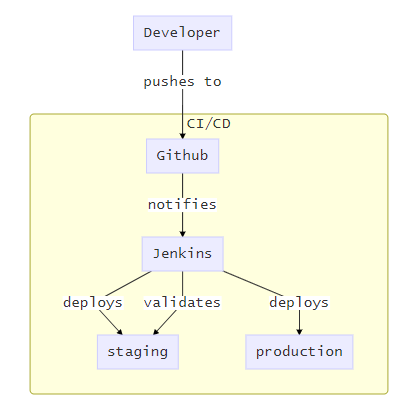
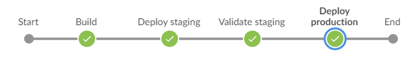

# Description

This repository is based on the [one provided by Xebia](https://github.com/xebia-france/click-count).  

It is a maven github project that will send notification to [a Jenkins server](http://zigip.hopto.org:8052/) which will start deploying the application.  
The application is first deployed on a [staging environment](http://zigip.hopto.org:8054/clickCount/) which is tested with `validity.py` selenium python script present here.  
It is then deployed again on the [production environment](http://zigip.hopto.org:8055/clickCount/) if the test were successful.  
The job responsible for this is described in this repository's `Jenkinsfile`.  

One may connect to the Jenkins using the following account:
 * **User**: xeb1
 * **Password**: xeb1

The following resources can help picture the whole process:  

# Click Count application

The application itself is a simple web app with counter and click button that increments it.

