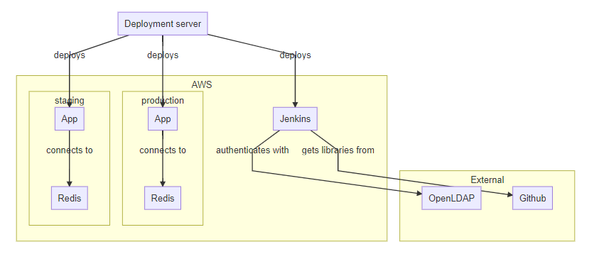

# Description

Deployment of the basic setup for the xeb clicker to be deployed in.  
It consists of:
 * A **Jenkins container**: It has a single job that will deploy the application if someone pushes to the xeb clicker repository
 * Two **environments**: A staging and production environment where the xeb clicker app can be deployed

It uses:
 * A preconfigured **OpenLDAP server**: The *base.ldif.stra* file contains a backup for all groups and users
 * A preconfigured **Groovy library**: It can be found [here](https://github.com/Chaest/clicker_groovylibs)

The following diagram is there to help vizualize the final installation:  

# The STRA encryption

The vault key and the LDIF are kept in this repository mostly for back up purposes.  
They have been encrypted using the *inastra* algorithm (a personal algorithm).  

If *inastra* is installed on the host server, the **play** script can be used to automatically decrypt the key during the deployment.  
The playbook `xebault_rt.yml` is present for regression testing purposes.

# Use

## Without inastra

Use the command: `ansible-playbook --vault-password-file vault.key deploy.yml -i xeb.yml`

## With inastra

Use the command: `./play deploy.yml -i xeb.yml`

# Contributors

 - Emmanuel Pluot (Chaest@Github)
